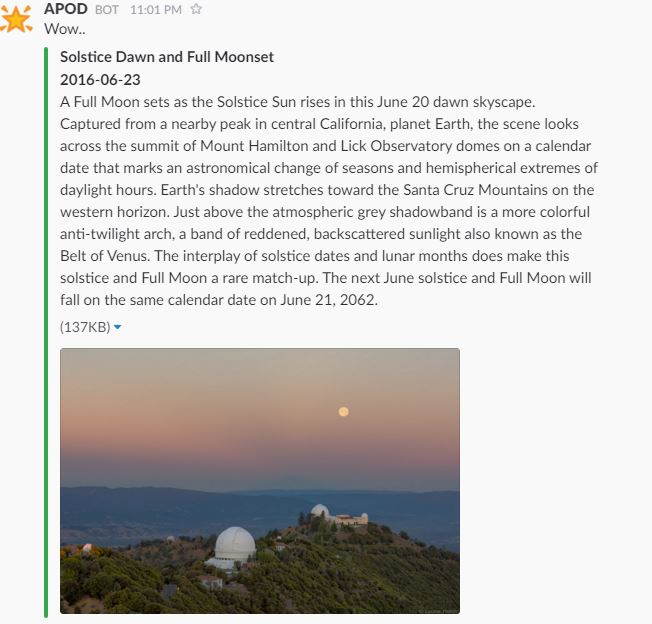

# slack-for-APOD
Slack bot that post Astronomy Picture of the Day.  


## Usage

```bash
node index.js [lang]
```
Support language: see [node-apod](https://github.com/SSARCandy/node-apod#support-language)


## Installation

1. Clone it & install dependences

  ```bash
  git clone https://github.com/SSARCandy/slack-for-APOD.git && cd slack-for-APOD
  npm install
  ```

2. Run it or use cronjob 
 - Run once, `node index.js`
 - Run with cronjob, add `0 12 * * * node ~/slack-for-APOD/index.js` to crontab. (post APOD everyday at noon)


## Reference
- [node-apod](https://github.com/SSARCandy/node-apod)
- [Get api key for NASA Open API](https://api.nasa.gov/index.html#apply-for-an-api-key)
- [Setting Incoming Webhooks in Slack](https://slack.com/apps/A0F7XDUAZ-incoming-webhooks)
